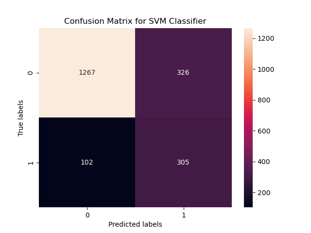

# Imperial AI & Machine Learning Capstone Project - Banking Customer Churn Detection  

Submitted by: Andrew Major

## NON-TECHNICAL EXPLANATION OF YOUR PROJECT

The idea of the project is to produce a machine learning model that will help detect customers who are likely to churn. The strategy can be simply broken down into the following steps:

* **Data Collection**: Gather historical customer data, including features such as account balance, credit score, customer demographics, etc.
* **Data Cleaning**: Handle missing values (impute or drop), remove irrelevant features, check for duplicates etc.
* **Data Exploration**: Understand the distribution of features and identify potential outliers ('rogue values').

* **Model Selection**: The following six alternative models were considered for use:

* Logistic Regression
* K-Nearest Neighbours
* Random Forest
* Gradient Boosting
* Support Vector Machines
* Neural Networks (Deep Learning)

The technical details of why these were selected and how they work need not be considered here; suffice to say that they are all good candidates for a binary classification task (i.e. predicting 'Yes' or 'No' to an outcome).

* **Performance Metrics**: We need to be able to compare the performance of these models in order to select the most suitable for the task. As we are aiming to predict a minority class (churners represent only 20% of our dataset), we are concerned with:

  * **Precision**: Proportion of actual churners out of all predicted churners.
  * **Recall (Sensitivity)**: Proportion of actual churners correctly predicted.
  * **F1-Score**: An aggregate measure combining precision and recall.

* **Data Preprocessing**:  Consider the nature of the data we have, and whether we need to combine or remove any before training our model.

* **Model Training and Evaluation**: Divide our data into a set for training the model, and a separate set to validate it afterwards (this checks how well the model works with data it has not been trained on).

* **Interpretability and Business Insights**:  Ultimately, we hope to be able to identify which categoreis of customer data are the strongest indicators of impending churn, and provide actionable insights to the business for remediation of churn.

## DATA

* The dataset is available for download on Kaggle [here](https://www.kaggle.com/datasets/saurabhbadole/bank-customer-churn-prediction-dataset/data); it is made available under the Creative Commons Attribution-NonCommercial-ShareAlike 4.0 International License.
* The data consists of 10,000 rows of data, ultimately reduced to nine features per row:
  * **CreditScore:** The credit score of the customer.
  * **Gender_Male:** Whether the customer is male (binary: yes/no).
  * **Age:** The age of the customer.
  * **Tenure:** The number of years the customer has been with the bank.
  * **Balance:** The account balance of the customer.
  * **NumOfProducts:* The number of bank products the customer has.
  * **HasCrCard:** Indicates whether the customer has a credit card (binary: yes/no).
  * **IsActiveMember:** Indicates whether the customer is an active member (binary: yes/no).
  * **EstimatedSalary:** The estimated salary of the customer.

## MODEL  

The model selected for final use is the Random Forest Classifier. This achieved:

* **Mean Cross-Validation Training F1**: 0.53926312
* **Validation Precision**: 0.75,
* **Validation Recall**: 0.434889435,
* **Validation F1**: 0.55054432

These figures are not ideal, but they represent the optimum balance of precision and recall that could be attained in this iteration. Further refinement of the model is required, potentially using Bayesian Optimisation to refine the choice of hyperparameters. Additional research into suitable FNN architecture refinements would also be of great interest.

## HYPERPARAMETER OPTIMSATION

The chosen hyperparameter optimisation strategy was to use the scikit-learn GridSearchCV and RandomizedGridSearchCV functions; although this is effectively a duplication of effort, I was interested to see how well the random search compared to a full grid search, both in terms of time and optimisation results. In the end, RandomizedSearchCV seemed to hit upon the same optimisation values as the brute force search, with reduced computing overheads (confirming what had been researched online).
The hyperparameters to be optimised, along with their eventual values are:

* **max_depth**: None
* **n_estimators**: 100

## RESULTS

As it stands, the best performing model is far from ideal. The plot below shows the comparison of F1 scores achieved in cross-validation training and hold-out validation.

The highest achieved training F1 score was 0.539263, with a corresponding validation score of 0.550544, recorded by the Random Forest Regressor. The confusion Matrix is shown below:

It can be seen that there is a high rate if false negatives (>50%), which is problematic. The SVM Classifier achieves the lowest rate of false negatives (still ~33%!) but has a huge rate of false positives. See below:

Without further refinement of the model, consultation with business domain experts would be required to determine what the most suitable model would be, if any.
